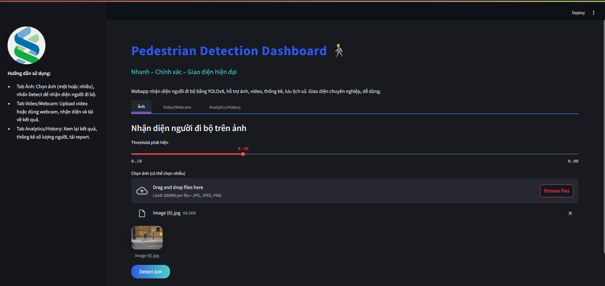
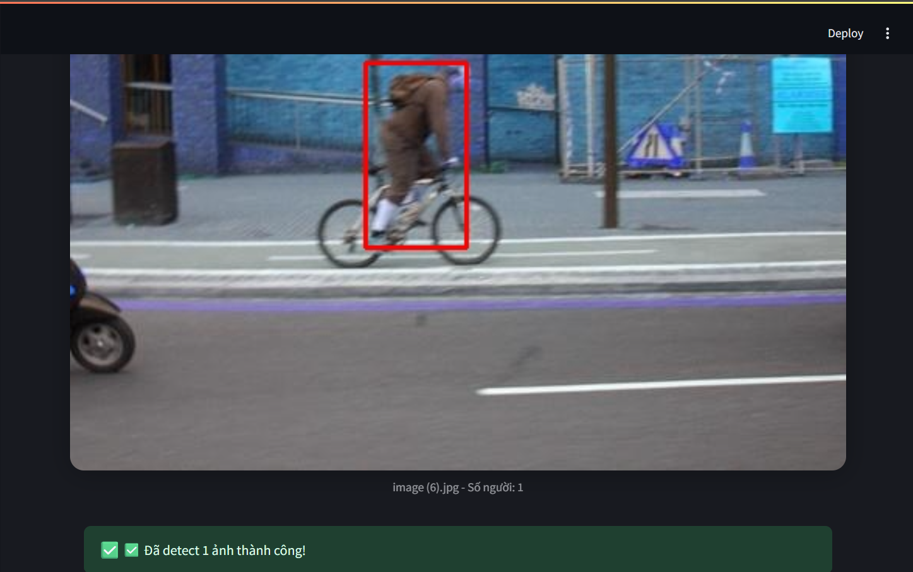
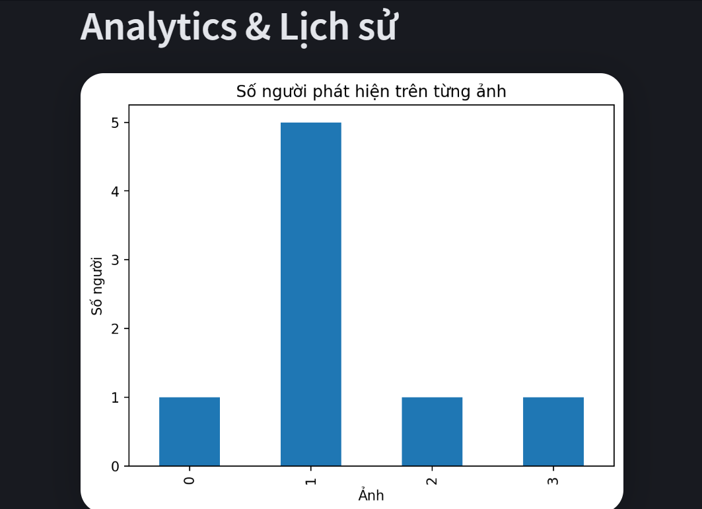
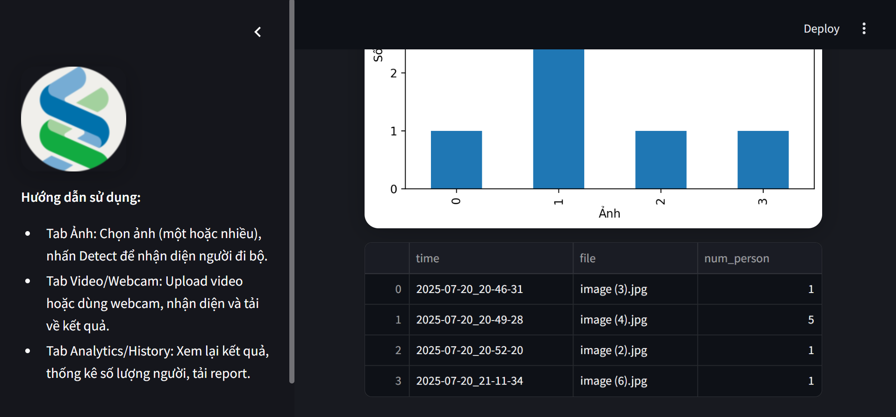

# 🚶‍♂️ Pedestrian Detection Dashboard

**Pedestrian Detection Dashboard** is a modern, production-ready web application for pedestrian detection in images, built with YOLOv8 and Streamlit.  
It offers an intuitive dashboard, batch detection, instant analytics, history log, and a stunning dark UI.

---

<p align="center">
  
</p>

---

## ✨ Features

- **Upload & detect multiple images** with one click
- **Real-time visualization** with bounding boxes & confidence scores
- **Modern dark dashboard UI** (custom CSS)
- **Instant analytics**: person count, detection history, summary charts
- **History table**: auto-logs every detection session
- **Extensible**: ready for video/webcam and PDF report features

---

## 📦 Installation

**1. Clone this repository:**
```bash
git clone https://github.com/yourusername/pedestrian_detection_dashboard.git
cd pedestrian_detection_dashboard
```
**2. Install dependencies:**
```bash
pip install -r requirements.txt
```
**3 .Download YOLOv8 weights:**
```bash
mkdir -p models
wget https://github.com/ultralytics/assets/releases/download/v8.0.0/yolov8n.pt -P models/
```
🚀 Usage
Run the web app:
```bash
streamlit run app.py
```
> Then open http://localhost:8501 in your browser.
---
🖼️ Screenshots
Dashboard Home
<p align="center">  </p>
Batch Upload and Detection
<p align="center">  </p>
Detection Results
<p align="center">  </p>
Analytics & History
<p align="center">  </p>

---
📝 How to Use
  -  Tab "Ảnh" (Images):
      -  Upload one or more images, adjust detection threshold, and click Detect ảnh to run detection.
          Results are shown instantly with bounding boxes and person count.

  -  Tab "Analytics/History":
      -  View detection analytics (number of people detected per image) and a complete detection history log.

  -  Tab "Video/Webcam":
      -  (Coming soon: Video and webcam detection features.)
---
📂 Project Structure
```bash
pedestrian_detection_dashboard/
│
├── app.py
├── requirements.txt
├── README.md
├── models/            # YOLOv8 weights
├── outputs/history/   # Detection history (auto)
├── static/            # Logo, style
├── src/               # Source code
├── img/               # Screenshots for documentation
└── ...

```
---
💡 Customization
  -  Theme: Easily customize dark/light colors via CSS in app.py.

  -  Detection Model: Swap YOLOv8 weights (e.g., use yolov8m.pt for higher accuracy).

  -  Analytics: Extend analytics in src/analytics.py.

  ---
  📢 License
  
  -  This project is released under the MIT License.
  ---
  🙌 Acknowledgements
  
  -  Ultralytics YOLOv8

  -  Streamlit
  ---

  👤 About the Author
  
  -  Le Phuoc Thai (Centrix/ChatGPT Team)

  -  📧 Email: lephuocthai860@gmail.com

  -  🌐 https://github.com/LePhuocThai2502

  -  💡 Passionate about AI, Computer Vision, and building user-friendly applications.

>  Feel free to reach out for collaboration, feedback, or consulting!

  


